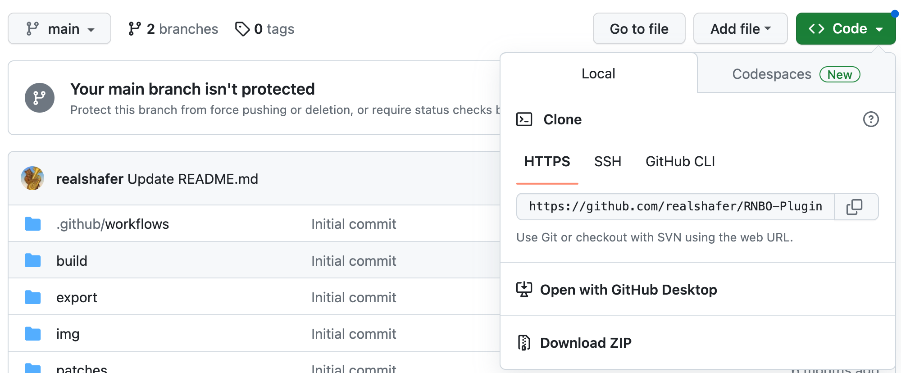
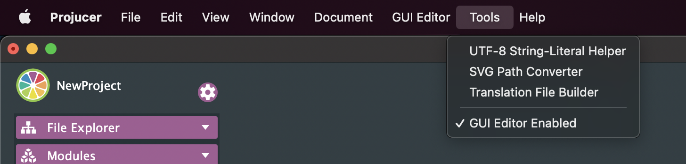
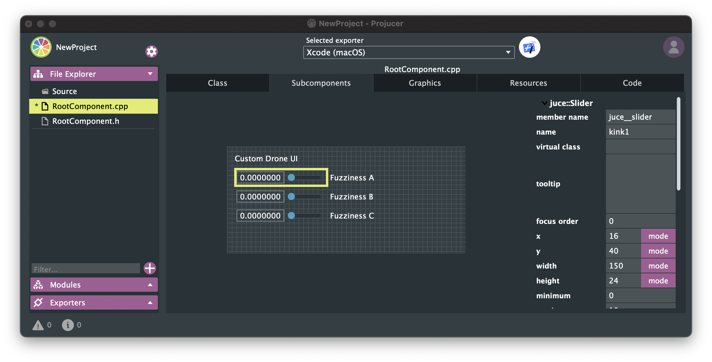
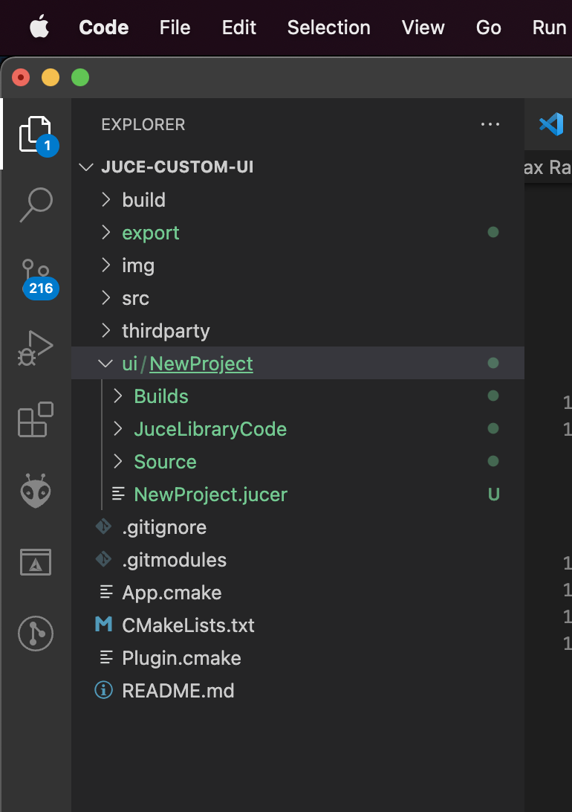

# RNBO JUCE Examples

So you want to build your own DAW or a Plugin? This template should get you started with your own Standalone Desktop application and Audio Plugin, using the source code export feature of RNBO, part of [Max 8](https://cycling74.com/max8/) made by [Cycling '74](https://cycling74.com/). 

This project is based on the cross-platform JUCE framework for handling audio processing. You have the option of using JUCE to manage your UI as well. Please be aware that the JUCE has its own license terms (mostly GPL with the availability of commercial licenses). See their [website](http://www.juce.com/) for further details.

## Prerequisites (for MacOS)

- In the MacOS Terminal, download and install [Homebrew](https://brew.sh/):
```
/bin/bash -c "$(curl -fsSL https://raw.githubusercontent.com/Homebrew/install/HEAD/install.sh)"
```
- Using Homebrew, download and install [CMake](https://cmake.org/download/):
```
brew install cmake
```
- Using Homebrew, download and install [git](https://git-scm.com/downloads):
```
brew install git
```
- Using Homebrew, download and install [Visual Studio Code](https://code.visualstudio.com/):
```
brew install --cask visual-studio-code
```
- Download [JUCE](https://juce.com/download/). Unzip the contents and copy it into your `Applications` folder.

## File structure

The source code of the application is in the `src/` directory. This directory should contain everything that you need to modify to build your application.

Some notable files/directories:

| Location                          | Explanation   |
| --------------------------------- | ------------- |
| export/                           | The directory into which you should export your RNBO code |
| src/                              | Source for the project - feel free to edit (includes sample UI) |
| build/RNBOApp_artefacts/          | Your built application will end up here |
| build/RNBOAudioPlugin_artefacts/  | Your built plugins will end up here |


# STEP 1: Cloning the Repository

If you're viewing this repo on Github, you should see a button at the top of the page that says `<> Code`. Copy the link under Clone -> HTTPS.



Make a local copy of this repository locally by using the following commands in Terminal:

```
cd ~/Desktop #change the directory to your desktop -- alternatively choose another folder
git clone URL #copy-paste the URL from GitHub
```

Additionally, you will need to download the linked JUCE submodule inside of the `ThirdParty` folder by using this command:

```
cd RNBO-Plugin
git submodule update --init --recursive --progress
```

If the above command doesn't work, try removing the --progress flag. If it still doesn't work, try removing the --recursive flag too.

# STEP 2: Exporting Your RNBO Plugin as C++ Source Code

Next, open the RNBO patcher you'd like to work with, and navigate to the export sidebar. Find "C++ Source Code Export" target.


Before exporting your project, set the Output Directory to the `export` folder inside `RNBO-Plugin`. Also, I highly suggest changing the Export Name to `rnbo_source.cpp` if it isn't already.

Export your project. Your export directory should look something like this:

```
export/
├─ rnbo/
├─ rnbo_source.cpp
├─ README.md
```

Whenever you make a change to your RNBO patch, remember to export the source code again to update this file.


# STEP 3: Build the Plugin Using CMake
Now that you've exported your RNBO code, it's time to build. This project uses CMake, which gives us the flexibility of using whatever build system we want. Start by moving to the build directory.

```sh
cd build
```

Now you have a choice of what build system you want to use. Any one of the following will work:

- `cmake ..`

This might be a good time to get a snack, as CMake can take a few minutes to get everything ready, especially when generating the build files for the first time. You may also see a number of warnings in the console, which you can (probably) safely ignore.

Once CMake has finished generating your build system, you can finally build your project.

```
cmake --build .
```

Invoking `cmake` with the `--build` flag tells CMake to build your target. After the build completes, you'll find the executable result in `build/RNBOApp_artefacts/Debug`, and you'll find plugins in `build/RNBOAudioPlugin_artefacts/Debug`.

Load the VST into the DAW of your choice and verify that it works using the default user interface. The next steps begin to replace this default UI.


# Step 4: Making a Custom UI in JUCE

Open the Projucer, the frontend application for the JUCE Framework. Create a new project, selecting the Basic plug-in project template. Use the defaults for modules and exporters. Now we need to decide where to save the `.jucer` file. We're not really going to be using this file too much, so it might be nice to keep it isolated from the rest of our code. I'm going to make a new folder in the root of the repository called `ui`, and I'll save the JUCE project there. After creating the project, your directory structure should look something like this:

```
build/
export/
├─ rnbo/
├─ rnbo_source.cpp
├─ README.md
img/
patches/
src/
thirdparty/
ui/
├─ NewProject/
├── Builds/
├── JuceLibraryCode/
├── Source/
```

The Projucer will automatically create four files for the PluginProcessor and PluginEditor. We won't be using these, so you can just delete them.

By default the GUI editor is not enabled. You may need to enable it from the Tools menu.



From the "GUI Editor" menu, select "Add new GUI Component" to add a `.cpp` and `.h` file for your new component. I named mine `RootComponent` because it's hard to come up with a good, original name. You can call yours whatever you want. Now let's add three sliders to our component. Navigate to "Subcomponents" and right-click to add these sliders. Let's also be careful to change the name of each component. Our three parameters are called `kink1`, `kink2`, and `kink3`, so give the sliders each one of these names. Later on, we'll use this name to map each slider to the RNBO parameter with the same name.

When you are done, "Save All."



Now we have two main tasks ahead of us.

1. Replace the default RNBO plugin UI with our custom interface.
2. Connect our sliders to the RNBO parameters.


# STEP 5: Switching to a Custom UI

Open up Visual Studio Code. Go to File > Open Folder and select your RNBO-Plugin folder. This should load your entire code director into the left panel. You can select files here and they will open up in the center for editing.



Open up `src/CustomAudioProcessor.cpp` and modify the section at the bottom so you are using the `CustomAudioEditor`.

```cpp
AudioProcessorEditor* CustomAudioProcessor::createEditor()
{
    //Change this to use your CustomAudioEditor
    return new CustomAudioEditor (this, this->_rnboObject);
    //return RNBO::JuceAudioProcessor::createEditor();
}
```

# Step 6: Adding the Interface to CMake

First, we need to make sure that the RootComponent.cpp and RootComponent.h files get added to our project. First, add these files to `Plugin.cmake` in the repository root.

```cmake
target_sources(RNBOAudioPlugin PRIVATE
  "${RNBO_CPP_DIR}/adapters/juce/RNBO_JuceAudioProcessor.cpp"
  "${RNBO_CPP_DIR}/adapters/juce/RNBO_JuceAudioProcessorEditor.cpp"
  "${RNBO_CPP_DIR}/RNBO.cpp"
  ${RNBO_CLASS_FILE}
  src/Plugin.cpp
  src/CustomAudioEditor.cpp
  src/CustomAudioProcessor.cpp
  ui/NewProject/Source/RootComponent.cpp
  )

include_directories(
  "${RNBO_CPP_DIR}/"
  "${RNBO_CPP_DIR}/common/"
  "${RNBO_CPP_DIR}/adapters/juce/"
  "${RNBO_CPP_DIR}/src/3rdparty/"
  src
  ui/NewProject/Source
  )
```

# Step 7: Tell CMake to Only Make a Plugin

Go to `CMakeLists.txt` and turn off the command to build an application by putting a # in front of the line:

## Sidenote about setting the RNBO export name

If you didn't use the RNBO export name `rnbo_source.app` previously, you can change the reference to your RNBO code inside of `CMakeLists.txt` on line 17:

```cmake
set(RNBO_CLASS_FILE_NAME "rnbo_source.cpp" CACHE STRING "the name of your rnbo class file")
```

## Test Build

Re-build your plugin at this point to make sure you don't have any errors yet. In Terminal:

```sh
cd build
cmake ..
cmake --build .
```

The plugin should build without errors, but of course we don't see our new `RootComponent` with its sliders yet. We need to add the `RootComponent` to our custom UI.

# Step 8: Adding the Custom Root Component to CustomAudioEditor
## In the header file
Open up `src/CustomAudioEditor.h`. First, add `RootComponent.h` to the include definitions.

```cpp
#include "JuceHeader.h"
#include "RNBO.h"
#include "RNBO_JuceAudioProcessor.h"
#include "RootComponent.h"
```

Next, find the declaration for the default `_label` member variable and replace it with one for a `RootComponent` component.

```cpp
// Label                _label;
RootComponent           _rootComponent;
```
## In the cpp file
Open up `src/CustomAudioEditor.cpp`. Find the constructor, where the default label is configured and sized. Replace that code with new code to size and configure the `RootComponent`.

```cpp
CustomAudioEditor::CustomAudioEditor (RNBO::JuceAudioProcessor* const p, RNBO::CoreObject& rnboObject)
    : AudioProcessorEditor (p)
    , _rnboObject(rnboObject)
    , _audioProcessor(p)
{
    _audioProcessor->AudioProcessor::addListener(this);

    // _label.setText("Hi I'm Custom Interface", NotificationType::dontSendNotification);
    // _label.setBounds(0, 0, 400, 300);
    // _label.setColour(Label::textColourId, Colours::black);
    // addAndMakeVisible(_label);
    // setSize (_label.getWidth(), _label.getHeight());

    addAndMakeVisible(_rootComponent);
    setSize(_rootComponent.getWidth(), _rootComponent.getHeight());
}
```

## Test Build
Rebuild using CMake, and you should see the generated UI loading in place of the default custom UI.

```sh
cd build
cmake ..
cmake --build .
```

# Step 9: Modifying the UI Code to Make the Sliders Functional
To make the sliders functional, we modify `RootComponent.h` and `RootComponent.cpp`. When the sliders change, we want to update the parameters of the `AudioProcessor`. When we get a parameter change notification from the `AudioProcessor`, we want to update the sliders.

## In the header file
Open up `RootComponent.h`. At the top of the file, include these RNBO header files.

```cpp
//[Headers]     -- You can add your own extra header files here --
#include <JuceHeader.h>
#include "RNBO.h"
#include "RNBO_JuceAudioProcessor.h"
//[/Headers]
```

Now add the following between the `[UserMethods]` tags:

```cpp
//[UserMethods]     -- You can add your own custom methods in this section.
void setAudioProcessor(RNBO::JuceAudioProcessor *p);
void updateSliderForParam(unsigned long index, double value);
//[/UserMethods]
```

Also add the following private instance variables
```cpp
//[UserVariables]   -- You can add your own custom variables in this section.
RNBO::JuceAudioProcessor *processor = nullptr;
HashMap<int, Slider *> slidersByParameterIndex; // used to map parameter index to slider we want to control
//[/UserVariables]
```
## In the cpp file
Now let's implement `setAudioProcessor`. Open up `RootComponent.cpp` and add the following after `[MiscUserCode]`.

```cpp
//[MiscUserCode] You can add your own definitions of your custom methods or any other code here...
void RootComponent::setAudioProcessor(RNBO::JuceAudioProcessor *p)
{
    processor = p;

    RNBO::ParameterInfo parameterInfo;
    RNBO::CoreObject& coreObject = processor->getRnboObject();

    for (unsigned long i = 0; i < coreObject.getNumParameters(); i++) {
        auto parameterName = coreObject.getParameterId(i);
        RNBO::ParameterValue value = coreObject.getParameterValue(i);
        Slider *slider = nullptr;
        if (juce::String(parameterName) == juce__slider.get()->getName()) {
            slider = juce__slider.get();
        } else if (juce::String(parameterName) == juce__slider2.get()->getName()) {
            slider = juce__slider2.get();
        } else if (juce::String(parameterName) == juce__slider3.get()->getName()) {
            slider = juce__slider3.get();
        }

        if (slider) {
            slidersByParameterIndex.set(i, slider);
            coreObject.getParameterInfo(i, &parameterInfo);
            slider->setRange(parameterInfo.min, parameterInfo.max);
            slider->setValue(value);
        }
    }
}

void RootComponent::updateSliderForParam(unsigned long index, double value)
{
    if (processor == nullptr) return;
    RNBO::CoreObject& coreObject = processor->getRnboObject();
    auto denormalizedValue = coreObject.convertFromNormalizedParameterValue(index, value);
    auto slider = slidersByParameterIndex.getReference((int) index);
    if (slider && (slider->getThumbBeingDragged() == -1)) {
        slider->setValue(denormalizedValue, NotificationType::dontSendNotification);
    }
}
//[/MiscUserCode]
```

Notice how we use the name of the slider to map the slider to a parameter with the matching ID. While we were here, we also laid the groundwork for updating the sliders with the correct values using the 'updateSliderForParam' code.

Continuing in `RootComponent.cpp`, find the function called `sliderValueChanged` and update it as follows:

```cpp
void RootComponent::sliderValueChanged (juce::Slider* sliderThatWasMoved)
{
    //[UsersliderValueChanged_Pre]
    if (processor == nullptr) return;
    RNBO::CoreObject& coreObject = processor->getRnboObject();
    auto parameters = processor->getParameters();
    //[/UsersliderValueChanged_Pre]

    if (sliderThatWasMoved == juce__slider.get())
    {
        //[UserSliderCode_juce__slider] -- add your slider handling code here..
        //[/UserSliderCode_juce__slider]
    }
    else if (sliderThatWasMoved == juce__slider2.get())
    {
        //[UserSliderCode_juce__slider2] -- add your slider handling code here..
        //[/UserSliderCode_juce__slider2]
    }
    else if (sliderThatWasMoved == juce__slider3.get())
    {
        //[UserSliderCode_juce__slider3] -- add your slider handling code here..
        //[/UserSliderCode_juce__slider3]
    }

    //[UsersliderValueChanged_Post]
    RNBO::ParameterIndex index = coreObject.getParameterIndexForID(sliderThatWasMoved->getName().toRawUTF8());
    if (index != -1) {
        const auto param = processor->getParameters()[index];
        auto newVal = sliderThatWasMoved->getValue();

        if (param && param->getValue() != newVal)
        {
            auto normalizedValue = coreObject.convertToNormalizedParameterValue(index, newVal);
            param->beginChangeGesture();
            param->setValueNotifyingHost(normalizedValue);
            param->endChangeGesture();
        }
    }
    //[/UsersliderValueChanged_Post]
}
```

This is all we need to control the RNBO patch using the sliders in our custom UI. However, to be really complete, we should also make sure that the sliders will update if RNBO changes the value of a parameter internally.


# Step 10: Updating Slider Values from the CustomAudioEditor

We'll need to call `setAudioProcessor` from the `CustomAudioEditor`. Open `CustomAudioEditor.cpp` and add the following line:

```cpp
_rootComponent.setAudioProcessor(p); // <--- add this line
addAndMakeVisible(_rootComponent);
setSize(_rootComponent.getWidth(), _rootComponent.getHeight());
```

Add the following to `audioProcessorParameterChanged`.

```cpp
void CustomAudioEditor::audioProcessorParameterChanged (AudioProcessor*, int parameterIndex, float value)
{
    _rootComponent.updateSliderForParam(parameterIndex, value);
}
```

## Test Build
That's it. Compile and build. You may need to restart your DAW in in order to see changes to your plugin.


# Step 11: The Continuing Development Process
Now that you've built a plugin with a custom UI, you will likely want to refine it. From this point, you can continue updating your RNBO code and then exporting it to the 'export' folder. You can continue refining your UI by working in the Projucer's GUI Editor, saving the resulting RootComponent.h and .cpp files. The manual changes to those files should be preserved as you update the UI (if not, you will have to remake those manual changes in Step 9). Re-build the plugin often to make sure you didn't introduce any breaking changes. Good luck!
